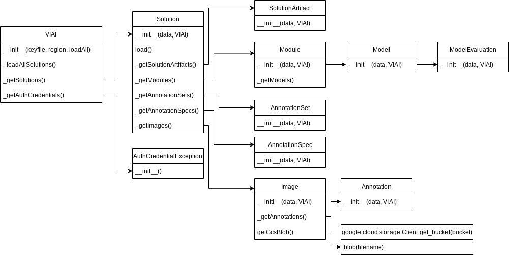

# VIAI-SDK

A project to make working with the VIAI (https://cloud.google.com/solutions/visual-inspection-ai) REST API easier. 

## Design

The current pre-alpha design: 

## Usage

Basic tasks for the VIAI SDK.

### Starting out

```
>>> from viai import VIAI
>>> a = VIAI(keyfile='viai-key.json')
>>> dir(a)
['__class__', '__delattr__', '__dict__', '__dir__', '__doc__', '__eq__', '__format__', '__ge__', '__getattribute__', '__gt__',
 '__hash__', '__init__', '__init_subclass__', '__le__', '__lt__', '__module__', '__ne__', '__new__', '__reduce__', 
 '__reduce_ex__', '__repr__', '__setattr__', '__sizeof__', '__str__', '__subclasshook__', '__weakref__', 
 '_getAuthCredentials', '_getSolutions', '_loadAllSolutions', 'apiUrl', 'author', 'credentials', 'projectId', 'region',
  'requestHeader', 'solutions']
```

## Loading a Solution/Dataset

```
>>> from viai import VIAI
>>> a = VIAI()
>>> b = a.solutions[0]
>>> b.load()
<viai.Solution object at 0x7ff0a9497310>
>>> b.load()
>>> dir(b)
['VIAI', '__class__', '__delattr__', '__dict__', '__dir__', '__doc__', '__eq__', '__format__', '__ge__', '__getattribute__', '__gt__', '__hash__', '__init_
_', '__init_subclass__', '__le__', '__lt__', '__module__', '__ne__', '__new__', '__reduce__', '__reduce_ex__', '__repr__', '__setattr__', '__sizeof__', '__
str__', '__subclasshook__', '__weakref__', '_getAnnotationSets', '_getAnnotationSpecs', '_getImages', '_getModules', '_getSolutionArtifacts', 'annotationSe
ts', 'annotationSpecs', 'apiUrl', 'createTime', 'datasetId', 'datasetUrl', 'displayName', 'images', 'load', 'log', 'modules', 'name', 'requestHeader', 'sol
utionArtifacts', 'solutionType', 'updateTime', 'url']
```

## Working with images in a solution

```
>>> from viai import VIAI
>>> a = VIAI(keyfile='viai-key.json')
>>> b = a.solutions[3]
>>> b.load()
2022-07-25 18:05:59,922 [INFO]  Loading Solution Data- style1horizontals
>>> c = b.images[0]
>>> d = c.getGcsBlob()
>>> type(d)
<class 'google.cloud.storage.blob.Blob'>
>>> d.public_url
'https://storage.googleapis.com/jduncan_viai_samples_style1/IMG_1854.HEIC.jpg'
```
## Development

### Unit Testing

The `nose2` test module is used for unit testing. To run tests, `nose2` uses the `unittest.cfg` file for default settings.

```
cd viai-sdk
nose2 
```

#### Test Coverage

```
cd viai-sdk
coverage run -m nose2
coverage report -m 
```

## Contributing

Merge requests are always welcome, and reach out to me at jamieduncan@google.com with ideas and questions!